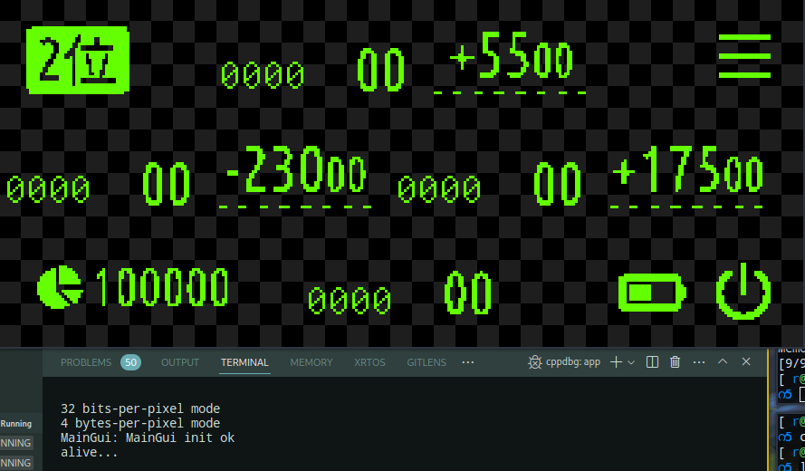
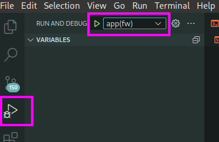

# emcppbase-templates

基于[emcppbase](https://github.com/noodlefighter/emcppbase)的工程模板。emcppbase提倡写可移植代码，硬件、平台相关与应用代码分离，本例程展示如何实现这一目标。


## 快速上手

工程依赖：

- just：https://github.com/casey/just
- cmake


### Step0.准备

示例工程以just作为脚手架（见justfile文件），请先自行安装just。

安装好Just后，在工程目录下输入just命令可以看到可执行的操作：

```
$ just
Available recipes:
    all
    clean
    default
    flash elf="app"
    flash_app
    fw debug="1"
    init
    mirror-pull
    mirror-push
    pc
    test
    unlock
```

初始化工程（展开子模块）

```
$ just init
```

### Step1. 构建PC程序

构建运行在PC上的程序：

```
$ just pc
```

构建好的入口程序（entrance）位于：

```
$ tree build/pc/project-root/entrance -L 1
build/pc/project-root/entrance
├── app
├── app2
├── app.bin
├── app.hex
├── app.lst
├── app.map
├── CMakeFiles
└── cmake_install.cmake
```

运行app的效果：




### Step2. 构建目标板上的固件、调试

固件工作在硬件是ch32v208，是自带BLE功能的低功耗蓝牙MCU方案

> 工具链下载：http://mounriver.com/download
>
> 安装好工具链后，修改：
>
> - target/fw/CMakeLists.txt中的TOOLPATH变量

执行构建：

```
$ just fw
```

构建好的固件：

```
$ ls -l build/fw/project-root/entrance
总计 4880
-rwxr-xr-x 1 r r 1471756  6月 7日 14:18 app
-rwxr-xr-x 1 r r  649432  6月 7日 14:18 app2
-rwxr-xr-x 1 r r   88556  6月 7日 14:26 app.bin
-rw-r--r-- 1 r r  249186  6月 7日 14:26 app.hex
-rw-r--r-- 1 r r 1361332  6月 7日 14:26 app.lst
-rw-r--r-- 1 r r 1155980  6月 7日 14:18 app.map
drwxr-xr-x 4 r r    4096  6月 7日 14:18 CMakeFiles
-rw-r--r-- 1 r r    1193  6月 7日 14:18 cmake_install.cmake
$ file build/fw/project-root/entrance/app
build/fw/project-root/entrance/app: ELF 32-bit LSB executable, UCB RISC-V, RVC, soft-float ABI, version 1 (SYSV), statically linked, with debug_info, not stripped
```


### Step3. 板上在线调试

> 由于工具链安装路径不同，请先配置：
>
> - `.vscode/launch.json`中配置openocd的位置
> - justfile中配置 `FW_OPENOCD_PATH` 变量

使用WCH-LINK连接目标板，将烧录固件到板上：

```
$ just flash elf=app
```

然后就可以在vscode中调试了：




## 工程简述


```
├── build      <---- 构建目录，编译出的文件在这里面
│   ├── fw
│   └── pc
├── CMakeLists.txt
├── entrance  <---- 入口程序，每个文件都是一个程序的入口，可以在不同入口里组合不同的功能模块，以实现不同业务功能
│   ├── app2.cpp
│   ├── app.cpp
│   └── CMakeLists.txt
├── lib       <---- 依赖的库
│   ├── emcppbase
│   └── u8g2
├── src       <---- 源文件目录，存放不同功能模块
│   ├── Application.cpp
│   ├── Application.h
│   ├── CMakeLists.txt
│   ├── main_config.h
│   ├── main_config.h.in
│   ├── MainGui.cpp
│   ├── MainGui.h
│   ├── ui
│   ├── WatchdogTask.cpp
│   └── WatchdogTask.h
├── target   <---- 构建目标，相当于BSP适配层，与平台、硬件相关
│   ├── fw
│   └── pc
```


说明一下src目录中的功能模块是怎么在不同目标中进行适配的，以MainGui模块为例：

```
class MainGui : public embase::AsyncTask {
public:
  const char *MODULE_NAME = "MainGui";
  MainGui() : AsyncTask(1,1), _logger(MODULE_NAME) {}

  virtual bool init();

  static MainGui* getInstance();

protected:
  embase::Logger _logger;
  U8G2 _u8g2;

  U8Ui::StackManager _stackMannager;
  HomeForm _homeForm;
  // MenuForm _menuForm;

  // 需在子类中适配
  virtual bool initDisplayBuffer() = 0;
  virtual int getKey() = 0;

private:
  int cnt = 0, o;
  int block_x = 0;
  int block_y = 42;
  const int block_w = 20;

  async_evt _taskEntry(struct async *pt) override final;
};

```

注意其中这些函数：

```
  // 单例模式，由适配层提供实例
  static MainGui* getInstance();
  
  // 虚函数，需在子类中适配
  virtual bool initDisplayBuffer() = 0;
  virtual int getKey() = 0;
```

适配层中，如fw目标中的适配`target/fw/MainGui-fw.cpp`：

```
#include "MainGui.h"

// 声明子类，在子类中实现这些需要适配的虚函数
class BoardMainGui : public MainGui {
protected:
  bool initDisplayBuffer() override {
    // todo:
    return TRUE;
  }
  int getKey() override {
    // todo:
    return 0;
  }
};

// 返回子类实例
BoardMainGui g_MainGui;
MainGui* MainGui::getInstance()
{
  return &g_MainGui;
}

```

